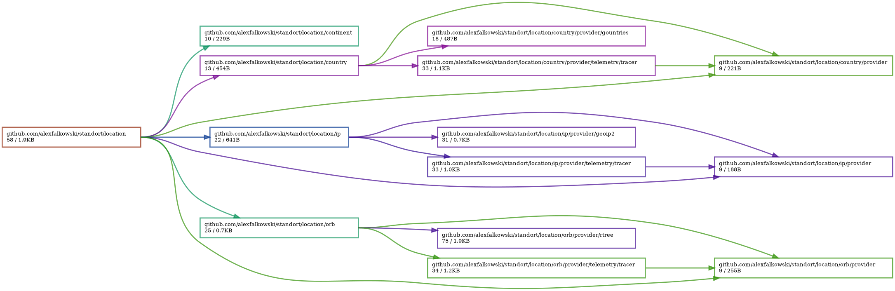
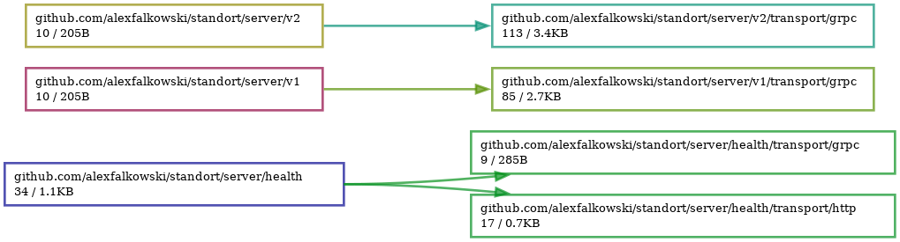
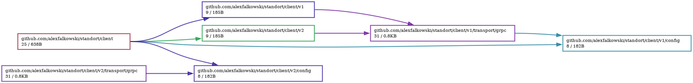

[](https://circleci.com/gh/alexfalkowski/standort)
[](https://codecov.io/gh/alexfalkowski/standort)
[](https://goreportcard.com/report/github.com/alexfalkowski/standort)
[](https://pkg.go.dev/github.com/alexfalkowski/standort)
[](https://masterminds.github.io/stability/active.html)

# Standort

Standort provides location based information.

## Location

The following locations are covered.

### IP Address

The service allows you to get the location by IP address using [geoip2](https://github.com/IncSW/geoip2).

### Countries/Continents

The service allows you to get the location based on [latitude/longitude](https://www.latlong.net/) using the power of [free maps](https://geojson-maps.ash.ms/).

### Dependencies



## Server

The server has the following versions.

### Versions

The service contains 2 versions of the API. These are as follows:
- V1 - has separate endpoints for IP and countries.
- V2 - combines both into one endpoint and uses the following headers:
  - For IP address we will use [X-Forwarded-For](https://developer.mozilla.org/en-US/docs/Web/HTTP/Headers/X-Forwarded-For) header.
  - For geo location we would use [Geolocation](http://tools.ietf.org/html/draft-thomson-geopriv-http-geolocation-00) header. The format is described as the [geo URI](https://www.rfc-editor.org/rfc/rfc5870).

### Dependencies



## Client

The client can be used in other projects.

### Configuration

This is configured as follows:

```yaml
client:
  v1:
    host: server_host
    retry:
      attempts: 3
      backoff: 100ms
      timeout: 3s
    timeout: 5s
    user_agent: "UA"
  v2:
    host: server_host
    retry:
      attempts: 3
      backoff: 100ms
      timeout: 3s
    timeout: 5s
    user_agent: "UA"
```

### Dependencies



## Development

If you would like to contribute, here is how you can get started.

### Structure

The project follows the structure in [golang-standards/project-layout](https://github.com/golang-standards/project-layout).

### Dependencies

Please make sure that you have the following installed:
- [Ruby](.ruby-version)
- Golang

### Style

This project favours the [Uber Go Style Guide](https://github.com/uber-go/guide/blob/master/style.md)

### Setup

The get yourself setup, please run the following:

```sh
make setup
```

### Binaries

To make sure everything compiles for the app, please run the following:

```sh
make build-test
```

### Features

To run all the features, please run the following:

```sh
make features
```

### Changes

To see what has changed, please have a look at `CHANGELOG.md`
